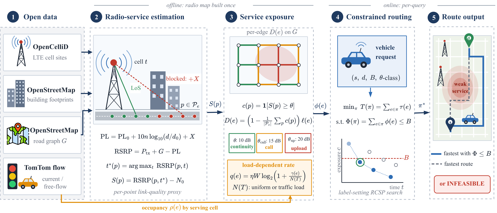
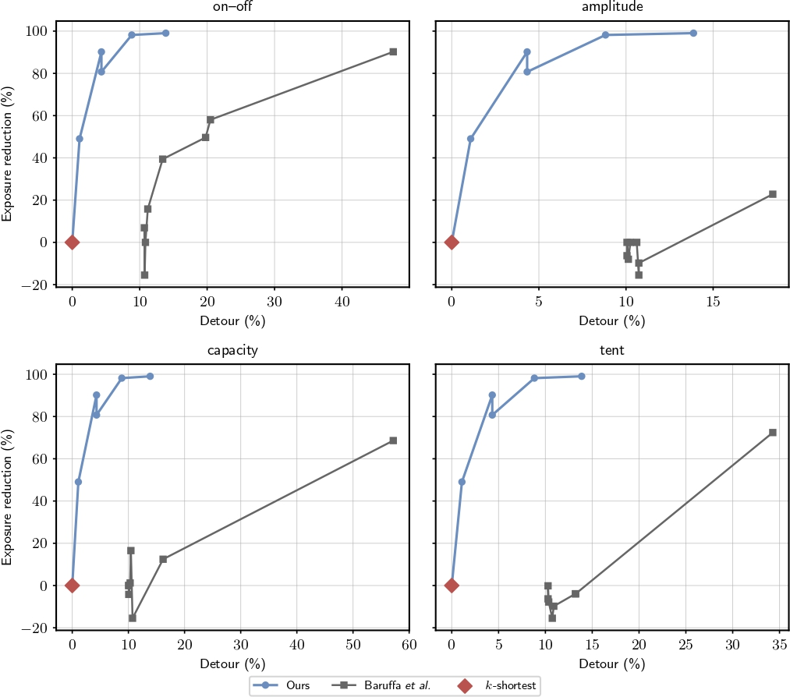
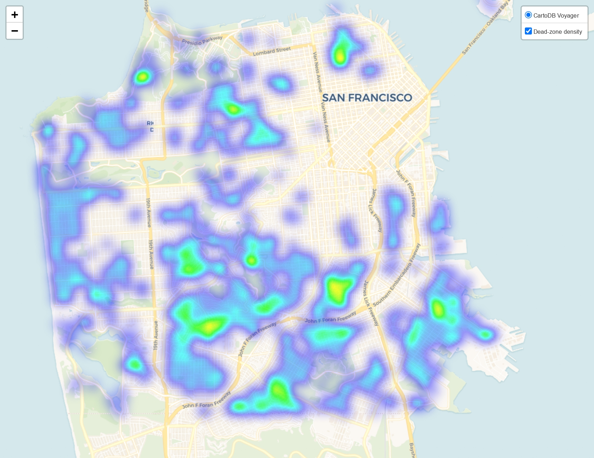
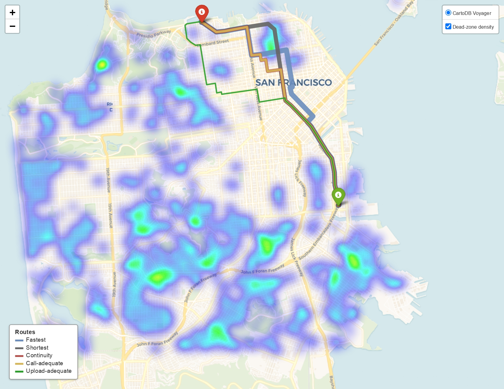

# Communication-Aware Path Planning for Connected Vehicles: Travel-Time Optimization Under Cellular Outage Constraints

Route selection for road-bound connected vehicles that minimizes travel time
subject to an explicit, interpretable budget on predicted cellular-outage
exposure. Formulated as a resource-constrained shortest-path problem and
solved with a label-setting search. Submitted to IEEE ICC 2027.

## Overview



Offline, open cell-location records (OpenCelliD), road and building geometry
(OpenStreetMap), and a log-distance propagation model are combined into a
per-edge radio-service estimate. Below-threshold exposure is computed at
three service levels (continuity, call-grade, upload-grade). Online, each
routing query specifies an origin, destination, exposure budget `B`, and
service class; a label-setting resource-constrained shortest-path search
returns the fastest route satisfying the budget, or reports infeasibility.

## Example results



*The constrained method (swept over budget `B`) reaches a given predicted
exposure reduction at roughly an order of magnitude smaller detour than the
strongest reproduced radio-coverage-aware baseline (Baruffa et al., on--off
variant), and substantially outperforms a weighted-sum scalarization and
`k`-shortest reranking.*



*Predicted below-threshold cellular service is spatially coherent, creating
route-dependent communication exposure for connected vehicles — the
motivation for treating route choice as a communication-aware decision.*



*The fastest and shortest routes cross predicted weak-service regions; the
continuity-, call-, and upload-aware routes detour around them, deviating
further as the service requirement gets stricter.*

## Key findings

- **Continuity-aware routing**: at a 100 m exposure budget, the constrained
  method removes a median 90–95% of predicted below-threshold distance at a
  4–8% median travel-time detour (varies by evaluation sample; see paper
  Table II).
- **Baseline comparison**: outperforms a reproduced radio-coverage-aware
  baseline (Baruffa et al., IEEE Access 2026 — all four radio-weight
  variants), a generic weighted-sum scalarization, and k-shortest reranking,
  reaching comparable exposure reduction at roughly an order of magnitude
  smaller detour than the strongest alternative.
- **Generalizes to stricter service classes** (call-grade, upload-grade)
  with the same constrained-budget construction.
- **Robust to the service threshold** across light/moderate/heavy
  below-threshold regimes (14%/23%/34% of edges below threshold).
- **Practical query latency**: median 30–140 ms, p95 under 1 s, on
  commodity/lab hardware — suitable for interactive single-query use.
- **Real traffic load matters**: cell load derived from real TomTom traffic
  data materially changes route selection versus a uniform-load assumption,
  requiring substantially larger detours to reach the same rate-adequate
  coverage.

Full results, figures, and discussion are in the paper (Overleaf project —
not tracked in this repo).

## Requirements

Python 3.12, via conda:

```bash
conda create -n connroute python=3.12
conda activate connroute
conda install -c conda-forge osmnx networkx pandas numpy shapely geopandas \
    matplotlib scipy folium tqdm requests pyyaml
```

Environment variables (API keys — never hardcode these):

```bash
conda env config vars set TOMTOM_API_KEY="your_key_here"
conda env config vars set CARTO_API_KEY="your_key_here"
conda activate connroute   # re-activate to pick up the new vars
```

Set `PYTHONPATH=src` (or run everything from the project root with the
package installed in editable mode) so `connroute` imports resolve.

## Project structure

```
connectivity-routing/
├── config.yaml                  # all tunable parameters
├── data/raw/                    # OpenCelliD tower data (US, MCC 310)
├── docs/figures/                 # README figures (tracked; small PNG copies)
├── src/connroute/
│   ├── config.py                 # typed config loader
│   ├── graph/                    # OSM road graph build/cache
│   ├── signal/                   # tower loading, propagation, per-edge signal layer
│   ├── objectives/                # exposure/rate objectives attached to the graph
│   ├── search/                    # label-setting constrained search, Baruffa
│   │                               #   reproduction, k-shortest, preferences
│   ├── experiment/                 # parallel experiment runner
│   └── viz/                        # plotting style helpers
├── experiments/                  # top-level experiment scripts (see run order)
├── notebooks/                    # numbered exploratory / smoke-test scripts
├── system-diagram/                # system pipeline figure source + PDF
├── tests/                         # unit tests for the constrained search
└── cache/, results/               # generated — gitignored, rebuilt by running the pipeline
```

## Running the pipeline

All commands assume `conda activate connroute` and the project root as the
working directory.

**1. Build the road graph (cached after first run):**
```bash
python -m connroute.graph.build
```

**2. Build the radio-service signal layer:**
```bash
python -m connroute.signal.layer
```

**3. Attach routing objectives (exposure, rate):**
```bash
python -m connroute.objectives.attach
```

**4. Run the experiments** (each is independent once steps 1–3 have cached
their outputs; run in any order, or only the ones you need):

| Script | What it produces |
|---|---|
| `experiments/exp_baruffa.py` | Ours vs. Baruffa (4 radio-weight variants) vs. weighted-sum vs. k-shortest — main comparison figure/table |
| `experiments/exp_baselines.py` | Continuity vs. fastest/shortest/weighted-sum baseline sweep |
| `experiments/exp_livecall.py` | Call-grade service-class trade-off |
| `experiments/exp_upload_adequate.py` | Upload-grade service-class trade-off |
| `experiments/exp_sensitivity.py` | Threshold sensitivity (light/moderate/heavy regimes); ~3 hours, common-feasible-set methodology |
| `experiments/exp_loadcompare.py` | Uniform vs. traffic-informed load comparison |
| `experiments/exp_example_routes.py` | Representative route-overlay figure |
| `notebooks/27_runtime_table.py` | Query-latency table |

Example:
```bash
python -m experiments.exp_baruffa
```

Each experiment writes a timestamped table to `results/tables/` and figures
to `results/figures/<category>/`.

**Note on `config.yaml`'s `load.use_traffic` flag**: set to `false` for all
experiments except `exp_loadcompare.py`, which explicitly sweeps both
settings internally.

**Note on parallelism**: experiment scripts use `run_parallel(...,
n_workers=N)`. On memory-constrained machines, keep `n_workers` low (2–4);
on the lab machine, higher values (8+) run safely.

## Reproducibility notes

- Random sampling is seeded (`config.yaml: seed`), but different experiment
  scripts sample independently — see the paper's Table II footnote for how
  populations are reconciled across service classes.
- `cache/` and `results/` are gitignored and rebuilt locally; nothing here
  is committed to the repository, except the small figure copies under
  `docs/figures/` used by this README.
- The TomTom traffic snapshot used in `exp_loadcompare.py` reflects
  conditions at query time — re-running will use current traffic, not the
  paper's original snapshot.

## Citation

If you use this code, please cite:

```bibtex
waiting...
```
